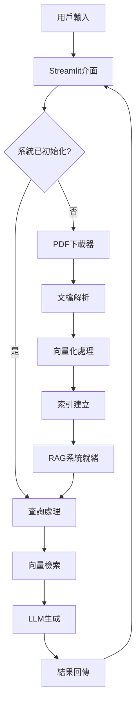
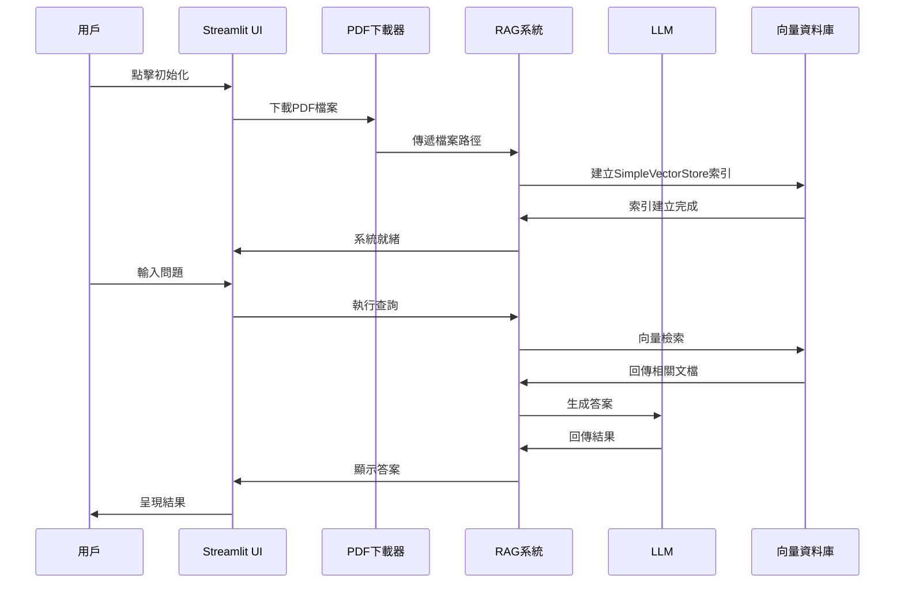

# 台灣茶葉知識RAG系統 - 技術說明文檔

## 目錄
1. [系統概述](#系統概述)
2. [資料來源與處理](#資料來源與處理)
3. [程式架構與邏輯](#程式架構與邏輯)
4. [核心套件說明](#核心套件說明)
5. [RAG工作流程](#rag工作流程)
6. [API與介面設計](#api與介面設計)
7. [資料流程圖](#資料流程圖)
8. [系統配置](#系統配置)
9. [錯誤處理與日誌](#錯誤處理與日誌)
10. [效能優化](#效能優化)
11. [擴展性考量](#擴展性考量)

---

## 系統概述

### 技術架構
本系統採用**Retrieval-Augmented Generation (RAG)**架構，結合檢索式和生成式AI技術，為台灣茶葉領域提供專業知識問答服務。

```
使用者問題 → 向量檢索 → 相關文檔片段 → LLM生成回答 → 回傳結果
```

### 核心組件
- **文檔處理層**: PDF下載、解析、文本提取
- **向量化層**: 文本嵌入、向量索引建立  
- **檢索層**: 語義相似度搜尋
- **生成層**: 基於檢索結果的答案生成
- **介面層**: Streamlit網頁應用程式

---

## 資料來源與處理

### 資料來源

#### 主要來源網站
```python
WEB_SOURCES = [
    "https://www.tbrs.gov.tw/ws.php?id=4189",  # 台灣茶業研究彙報摘要
    "https://www.tbrs.gov.tw/ws.php?id=1569",  # 其他茶業相關頁面
]
```

#### 預設PDF文件
```python
PDF_SOURCES = {
    "茶業研究彙報": [
        "https://www.tbrs.gov.tw/files/tbrs/web_structure/4399/A01_1.pdf",  # 第1期
        "https://www.tbrs.gov.tw/files/tbrs/web_structure/4410/A01_1.pdf",  # 第2期
        "https://www.tbrs.gov.tw/files/tbrs/web_structure/4427/A01_1.pdf",  # 第3期
    ]
}
```

### 資料處理流程

#### 1. 自動連結發現
```python
def extract_pdf_links_from_page(url: str) -> List[str]:
    """
    從網頁HTML中提取PDF連結
    - 使用BeautifulSoup解析HTML
    - 搜尋所有href包含.pdf的<a>標籤
    - 處理相對路徑與絕對路徑
    """
```

**處理邏輯**:
1. 發送HTTP請求取得網頁內容
2. 使用BeautifulSoup解析HTML結構
3. 尋找所有包含`.pdf`的連結
4. 處理相對路徑轉換為絕對路徑
5. 去除重複連結並驗證有效性

#### 2. PDF文件下載
```python
def download_pdf(self, url: str, filename: str) -> bool:
    """
    下載PDF檔案並驗證完整性
    - 使用streaming下載避免記憶體溢出
    - 添加User-Agent避免被網站阻擋
    - 驗證檔案大小確保下載完整
    """
```

**關鍵特性**:
- **串流下載**: 分塊下載大型PDF檔案
- **斷點續傳**: 檢查檔案是否已存在
- **進度追蹤**: 即時顯示下載進度
- **錯誤處理**: 網路異常自動重試

#### 3. 文檔解析與處理
```python
reader = PyMuPDFReader()
docs = reader.load_data(file_path=pdf_path)
```

**處理步驟**:
1. **PDF解析**: 使用PyMuPDF提取文本內容
2. **文本清理**: 移除多餘空白和特殊字符
3. **元數據添加**: 為每個文檔片段添加來源資訊
4. **分塊處理**: 將長文檔分割成適當大小的片段

#### 4. 文本分塊策略
```python
Settings.node_parser = SimpleNodeParser.from_defaults(chunk_size=1024)
```

**分塊原則**:
- **固定大小**: 每個文本塊1024個字符
- **語義完整性**: 盡量保持句子完整
- **重疊處理**: 相鄰塊之間保持適當重疊
- **元數據保留**: 每個塊保留原始文檔資訊

---

## 程式架構與邏輯

### 模組化設計

#### 核心模組關係圖
```
config.py (配置管理)
    ↓
utils.py (工具函數)
    ↓
pdf_downloader.py → enhanced_pdf_downloader.py (資料獲取)
    ↓
rag_system.py (RAG核心)
    ↓
app.py → enhanced_app.py (使用者介面)
```

### 關鍵類別設計

#### 1. RAGSystem類別
```python
class RAGSystem:
    def __init__(self):
        self.index = None           # 向量索引
        self.query_engine = None    # 查詢引擎
        self._setup_models()        # 初始化模型
```

**主要方法**:
- `_setup_models()`: 配置LLM和嵌入模型
- `load_pdfs()`: 載入並處理PDF文檔
- `create_index()`: 建立向量索引
- `setup_query_engine()`: 配置查詢引擎
- `query()`: 執行問答查詢

#### 2. EnhancedPDFDownloader類別
```python
class EnhancedPDFDownloader:
    def __init__(self):
        self.pdf_dir = PDF_DIR
        self.discovered_links = {}
```

**核心功能**:
- 自動發現PDF連結
- 批量下載管理
- 檔案資訊追蹤
- 下載進度顯示

### 狀態管理

#### Streamlit Session State
```python
# 系統狀態管理
if 'rag_system' not in st.session_state:
    st.session_state.rag_system = None
if 'system_ready' not in st.session_state:
    st.session_state.system_ready = False
```

**狀態變數**:
- `rag_system`: RAG系統實例
- `system_ready`: 系統初始化狀態
- `downloader`: PDF下載器實例  
- `chat_history`: 問答歷史記錄

---

## 核心套件說明

### 1. LlamaIndex
**功能**: RAG框架核心
```python
from llama_index.core import VectorStoreIndex, Document, Settings
```

**主要組件**:
- **VectorStoreIndex**: 向量索引管理
- **Document**: 文檔對象封裝
- **Settings**: 全域配置管理
- **StorageContext**: 儲存上下文管理

**使用方式**:
```python
# 建立索引
index = VectorStoreIndex.from_documents(documents)

# 設定查詢引擎
query_engine = index.as_query_engine(
    similarity_top_k=3,
    response_mode="compact"
)
```

### 2. Groq LLM
**功能**: 高效能語言模型服務
```python
from llama_index.llms.groq import Groq
```

**配置參數**:
```python
llm = Groq(
    model="llama3-8b-8192",
    api_key=GROQ_API_KEY
)
```

**模型特性**:
- **高速推理**: 基於專用硬體加速
- **大上下文**: 支援8192 tokens上下文長度
- **多語言**: 支援繁體中文處理

### 3. HuggingFace Embeddings
**功能**: 文本向量化
```python
from llama_index.embeddings.huggingface import HuggingFaceEmbedding
```

**模型選擇**:
```python
embed_model = HuggingFaceEmbedding(
    model_name="sentence-transformers/all-MiniLM-L6-v2"
)
```

**模型特性**:
- **輕量級**: 參數量適中，推理速度快
- **多語言**: 支援中文語義理解
- **高品質**: 在語義相似度任務上表現優異

### 4. SimpleVectorStore
**功能**: LlamaIndex 內建向量儲存
```python
from llama_index.core.vector_stores import SimpleVectorStore
```

**儲存特性**:
- **輕量級**: 簡單易用的本地向量儲存
- **檔案持久化**: 支援向量索引本地儲存為檔案
- **內建支援**: LlamaIndex 原生整合，無需額外配置
- **適中規模**: 適合中小型文檔集合（數千到數萬個文檔）

**使用方式**:
```python
# 預設使用 SimpleVectorStore
index = VectorStoreIndex.from_documents(documents)

# 手動指定 SimpleVectorStore
from llama_index.core.storage.storage_context import StorageContext
vector_store = SimpleVectorStore()
storage_context = StorageContext.from_defaults(vector_store=vector_store)
index = VectorStoreIndex.from_documents(documents, storage_context=storage_context)
```

**優點**:
- 零配置，開箱即用
- 檔案系統持久化
- 記憶體占用較低
- 適合快速原型開發

**限制**:
- 擴展性有限
- 缺乏進階查詢功能
- 無分散式支援

### 5. Streamlit
**功能**: 網頁應用程式框架
```python
import streamlit as st
```

**介面組件**:
- **互動元件**: 按鈕、輸入框、選擇器
- **布局管理**: 欄位、容器、側邊欄
- **狀態管理**: Session State
- **即時更新**: 自動重新渲染

### 6. PyMuPDF
**功能**: PDF文檔處理
```python
from llama_index.readers.file import PyMuPDFReader
```

**處理能力**:
- **文本提取**: 高品質文本內容提取
- **版面保持**: 保留原始文檔結構
- **中文支援**: 良好的中文字符處理
- **元數據**: 提取文檔元資訊

---

## RAG工作流程

### 完整處理流程

#### 1. 資料獲取階段
```
網頁爬取 → PDF連結發現 → 檔案下載 → 完整性驗證
```

#### 2. 文檔處理階段  
```
PDF解析 → 文本提取 → 內容清理 → 分塊處理 → 元數據添加
```

#### 3. 向量化階段
```
文本嵌入 → 向量生成 → 索引建立 → 儲存持久化
```

#### 4. 查詢階段
```
用戶問題 → 問題嵌入 → 相似度計算 → 文檔檢索 → 結果排序
```

#### 5. 生成階段
```
檢索結果 → 上下文組合 → LLM推理 → 答案生成 → 結果回傳
```

### 詳細實作邏輯

#### SimpleVectorStore 工作原理
```python
# SimpleVectorStore 的核心工作流程
class SimpleVectorStore:
    def __init__(self):
        self.data = {}  # 儲存向量和元數據
        
    def add(self, nodes):
        """添加文檔節點到向量儲存"""
        for node in nodes:
            # 使用嵌入模型生成向量
            vector = self.embedding_model.get_text_embedding(node.text)
            self.data[node.node_id] = {
                'vector': vector,
                'text': node.text,
                'metadata': node.metadata
            }
    
    def query(self, query_vector, similarity_top_k=3):
        """查詢最相似的文檔"""
        similarities = []
        for node_id, data in self.data.items():
            # 計算餘弦相似度
            similarity = cosine_similarity(query_vector, data['vector'])
            similarities.append((node_id, similarity))
        
        # 排序並回傳前k個結果
        similarities.sort(key=lambda x: x[1], reverse=True)
        return similarities[:similarity_top_k]
```

#### 查詢處理流程
```python
def query(self, question: str) -> str:
    """
    1. 將問題轉換為向量 (使用 HuggingFace 嵌入模型)
    2. 在 SimpleVectorStore 中搜尋相似文檔
    3. 取得top-k相關文檔片段
    4. 組合問題與相關文檔作為LLM輸入
    5. 使用 Groq LLM 生成並回傳答案
    """
```

#### 相似度計算 (SimpleVectorStore 內部)
```python
# SimpleVectorStore 使用餘弦相似度計算
import numpy as np

def cosine_similarity(vector1, vector2):
    """計算兩個向量的餘弦相似度"""
    dot_product = np.dot(vector1, vector2)
    norm1 = np.linalg.norm(vector1)
    norm2 = np.linalg.norm(vector2)
    return dot_product / (norm1 * norm2)
```

#### 檔案持久化機制
```python
# SimpleVectorStore 的持久化
def persist(self, persist_dir: str):
    """將向量資料儲存到檔案系統"""
    vector_store_path = os.path.join(persist_dir, "vector_store.json")
    with open(vector_store_path, 'w') as f:
        json.dump(self.data, f)

def load_from_disk(self, persist_dir: str):
    """從檔案系統載入向量資料"""
    vector_store_path = os.path.join(persist_dir, "vector_store.json")
    if os.path.exists(vector_store_path):
        with open(vector_store_path, 'r') as f:
            self.data = json.load(f)
```

#### 上下文組合策略
```python
# 將檢索到的文檔片段組合為LLM輸入
context = "\n".join([doc.text for doc in retrieved_docs])
prompt = f"基於以下資料回答問題:\n{context}\n\n問題: {question}"
```

---

## API與介面設計

### 核心API設計

#### 1. 系統初始化API
```python
def perform_full_initialization(auto_discover: bool, use_existing: bool) -> bool:
    """
    執行完整系統初始化
    參數:
        auto_discover: 是否自動發現PDF連結
        use_existing: 是否使用已存在的檔案
    回傳: 初始化是否成功
    """
```

#### 2. 查詢API
```python
def query(self, question: str) -> str:
    """
    執行問答查詢
    參數:
        question: 用戶問題
    回傳: AI生成的答案
    """
```

#### 3. 檔案管理API
```python
def get_existing_pdfs(self) -> List[str]:
    """取得已存在的PDF檔案列表"""

def get_pdf_info(self) -> Dict[str, Dict]:
    """取得PDF檔案詳細資訊"""
```

### 使用者介面設計

#### 1. 響應式布局
```python
# 主要內容區域
col1, col2 = st.columns([4, 1])
with col1:
    question = st.text_input("請輸入問題")
with col2:
    ask_button = st.button("提問")
```

#### 2. 狀態指示器
```python
# 視覺化系統狀態
status_color = "🟢" if system_ready else "🟡"
st.markdown(f"系統狀態: {status_color}")
```

#### 3. 進度追蹤
```python
# 下載進度顯示
progress_bar = st.progress(0)
for i, file in enumerate(files):
    progress_bar.progress((i + 1) / len(files))
```

---

## 資料流程圖

### 系統架構圖


### 資料處理流程


---

## 系統配置

### 環境變數配置
```python
# .env 檔案
GROQ_API_KEY=your_groq_api_key_here
```

### 模型配置
```python
# config.py
EMBEDDING_MODEL = "sentence-transformers/all-MiniLM-L6-v2"
LLM_MODEL = "llama3-8b-8192"
```

### 檔案路徑配置
```python
DATA_DIR = "data"
PDF_DIR = os.path.join(DATA_DIR, "pdfs")
INDEX_DIR = os.path.join(DATA_DIR, "index")
```

### 查詢參數配置
```python
query_engine = index.as_query_engine(
    similarity_top_k=3,        # 檢索前3個最相關文檔
    response_mode="compact"    # 緊湊回應模式
)
```

---

## 錯誤處理與日誌

### 異常處理策略

#### 1. 網路錯誤處理
```python
try:
    response = requests.get(url, timeout=30)
    response.raise_for_status()
except requests.exceptions.RequestException as e:
    st.error(f"網路錯誤: {str(e)}")
    return False
```

#### 2. 檔案處理錯誤
```python
try:
    docs = reader.load_data(file_path=pdf_path)
except Exception as e:
    st.error(f"載入檔案失敗: {str(e)}")
    continue
```

#### 3. API錯誤處理
```python
try:
    response = self.query_engine.query(question)
except Exception as e:
    st.error(f"查詢失敗: {str(e)}")
    return "抱歉，處理您的問題時發生錯誤。"
```

### 日誌記錄
```python
import logging

logging.basicConfig(
    level=logging.INFO,
    format='%(asctime)s - %(levelname)s - %(message)s'
)
```

---

## 效能優化

### 1. SimpleVectorStore 優化策略
- **持久化儲存**: 利用檔案系統避免重複建立索引
- **分批處理**: 處理大量文檔時分批載入避免記憶體不足
- **索引重用**: 檢查現有索引檔案，避免重複處理

```python
# 實際的索引重用邏輯 (來自 rag_system.py)
def create_index(self, documents: List[Document]) -> VectorStoreIndex:
    try:
        # 檢查是否已有現存的索引
        if os.path.exists(INDEX_DIR) and os.listdir(INDEX_DIR):
            storage_context = StorageContext.from_defaults(persist_dir=INDEX_DIR)
            index = VectorStoreIndex.from_documents(
                documents, 
                storage_context=storage_context
            )
            st.info("使用現有索引")
        else:
            # 建立新索引 (使用預設的 SimpleVectorStore)
            index = VectorStoreIndex.from_documents(documents)
            # 儲存索引到檔案系統
            index.storage_context.persist(persist_dir=INDEX_DIR)
            st.success("成功建立新索引")
```

### 2. 快取機制
```python
@st.cache_data
def load_processed_documents():
    """快取已處理的文檔"""
    pass
```

### 3. 並行處理
```python
from concurrent.futures import ThreadPoolExecutor

def parallel_download(urls):
    with ThreadPoolExecutor(max_workers=4) as executor:
        futures = [executor.submit(download_pdf, url) for url in urls]
```

### 4. 資源管理
- **分塊載入**: 避免一次載入所有文檔
- **記憶體監控**: 監控系統資源使用
- **垃圾回收**: 及時釋放不需要的對象

---

## 擴展性考量

### 1. 資料來源擴展
```python
# 支援多種文檔格式
SUPPORTED_FORMATS = ['.pdf', '.docx', '.txt', '.md']

# 支援多種資料來源
DATA_SOURCES = {
    'web_scraping': WebScraper(),
    'database': DatabaseConnector(),
    'api': APIClient()
}
```

### 2. 模型擴展
```python
# 支援多種LLM提供者
LLM_PROVIDERS = {
    'groq': GroqLLM,
    'openai': OpenAILLM,
    'huggingface': HuggingFaceLLM
}
```

### 3. 儲存擴展
```python
# 目前使用 SimpleVectorStore，未來可支援多種向量資料庫
VECTOR_STORES = {
    'simple': SimpleVectorStore,          # 目前使用
    'chroma': ChromaVectorStore,          # 後續優化選項
    'pinecone': PineconeVectorStore,      # 雲端選項
    'weaviate': WeaviateVectorStore       # 企業級選項
}
```

**升級路徑**:
1. **當前階段**: SimpleVectorStore（適合開發和中小規模部署）
2. **效能優化**: 升級到 ChromaDB（提升檢索效能和功能）
3. **規模擴展**: 考慮 Pinecone 或 Weaviate（大規模生產環境）

### 4. 部署擴展
- **容器化**: Docker部署支援
- **雲端部署**: AWS/GCP/Azure支援
- **微服務**: API服務拆分
- **負載均衡**: 多實例部署

---

## 總結

本RAG系統採用模組化設計，基於 **LlamaIndex + SimpleVectorStore** 架構，具備以下特點：

### 核心技術棧
- **RAG框架**: LlamaIndex
- **向量儲存**: SimpleVectorStore (輕量級檔案儲存)
- **LLM**: Groq Llama3-8B-8192
- **嵌入模型**: HuggingFace Sentence Transformers
- **前端介面**: Streamlit

### 系統特色
- **高度可配置**: 支援多種模型和參數調整
- **自動化處理**: 從資料獲取到索引建立全自動化
- **使用者友善**: 直觀的網頁介面和即時反饋
- **輕量部署**: 基於 SimpleVectorStore 的簡化部署
- **效能優化**: 檔案快取機制和索引持久化
- **錯誤處理**: 完善的異常處理和用戶提示

### 適用場景
- **中小型知識庫**: 適合千到萬級文檔量
- **快速原型開發**: 零配置向量儲存
- **本地化部署**: 無需額外資料庫服務
- **教育研究**: 簡單易懂的技術架構

### 升級路徑
1. **當前版本**: SimpleVectorStore 滿足基本需求
2. **效能升級**: 未來可升級至 ChromaDB 提升檢索效能
3. **規模擴展**: 考慮 Pinecone 或 Weaviate 支援大規模部署

透過此技術文檔，開發者可以深入理解系統架構，進行客製化開發和系統維護。 